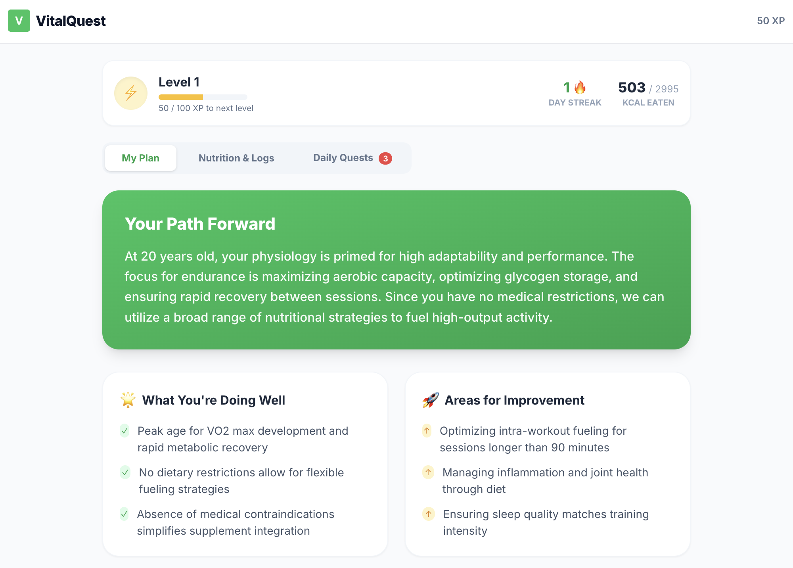
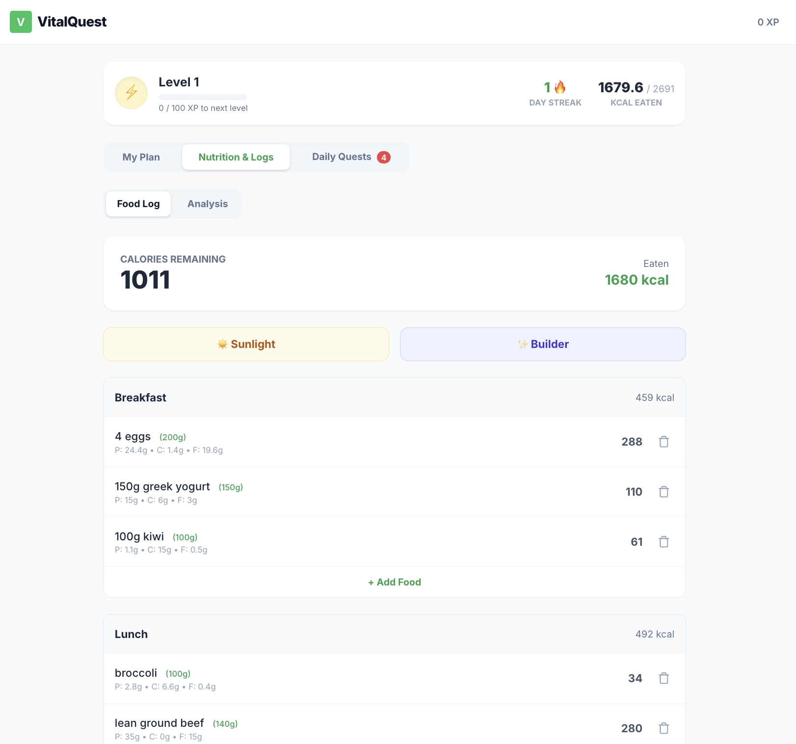
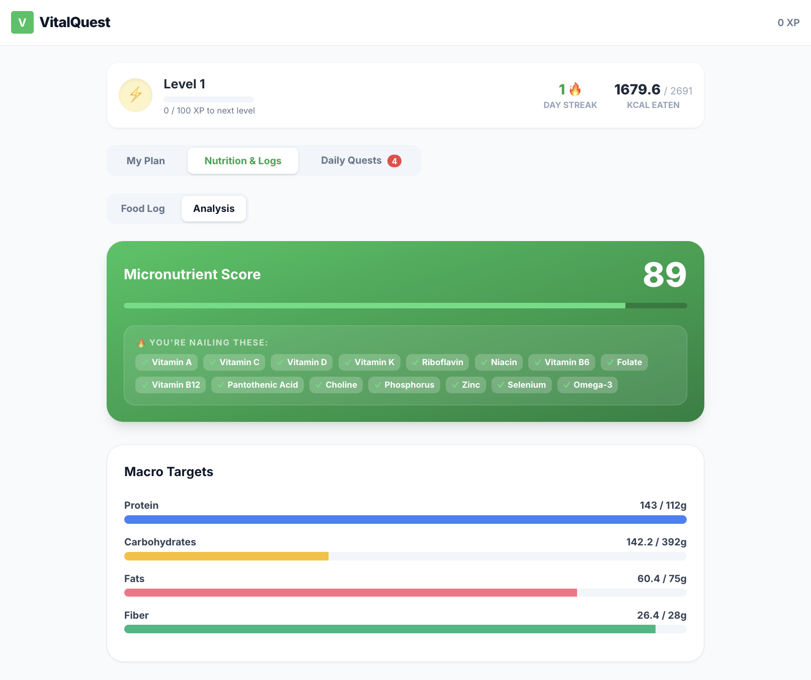

# VitalQuest

AI-Powered Micronutrient Intelligence App  
Transforming daily nutrition data into actionable performance insights.

---

## 🚀 Overview

VitalQuest is a TypeScript-based health intelligence platform that converts micronutrient intake into a dynamic performance score using an AI-driven scoring model.

The system translates complex nutritional inputs into actionable, contextual recommendations to optimize health and athletic performance.

---

## 📸 Screenshots

### Dashboard


---

### Food Log


---

### Micronutrient Score


---

## 🧠 Core Features

- Daily micronutrient scoring engine (MicroScore algorithm)
- AI-powered contextual recommendations
- Modular TypeScript architecture
- Gamified performance tracking system
- Clean separation of UI and processing logic

---

## 🏗 System Architecture

User Input  
↓  
Micronutrient Processing  
↓  
MicroScore Algorithm  
↓  
AI Recommendation Engine  
↓  
UI Update  

---

## 🛠 Tech Stack

- TypeScript
- React (Vite)
- Google AI Studio (Gemini API)
- Modular component architecture

---

## ▶ Live Prototype

Built and tested in Google AI Studio.

Live Demo:
https://ai.studio/apps/drive/1yEQ6ceFl7UpZ82to5k2G1K5iXA6IxQLy

---

## 📦 Run Locally

```bash
npm install
npm run dev
