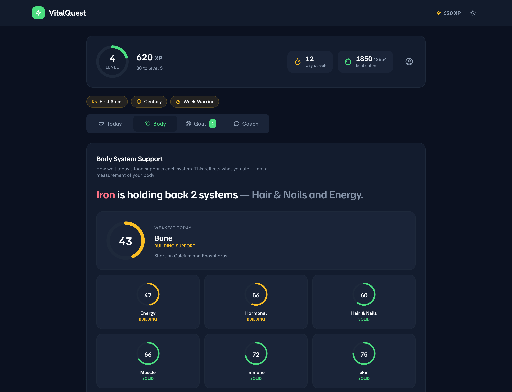
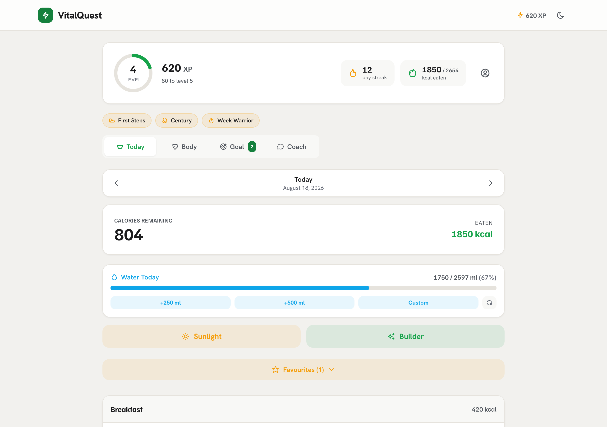
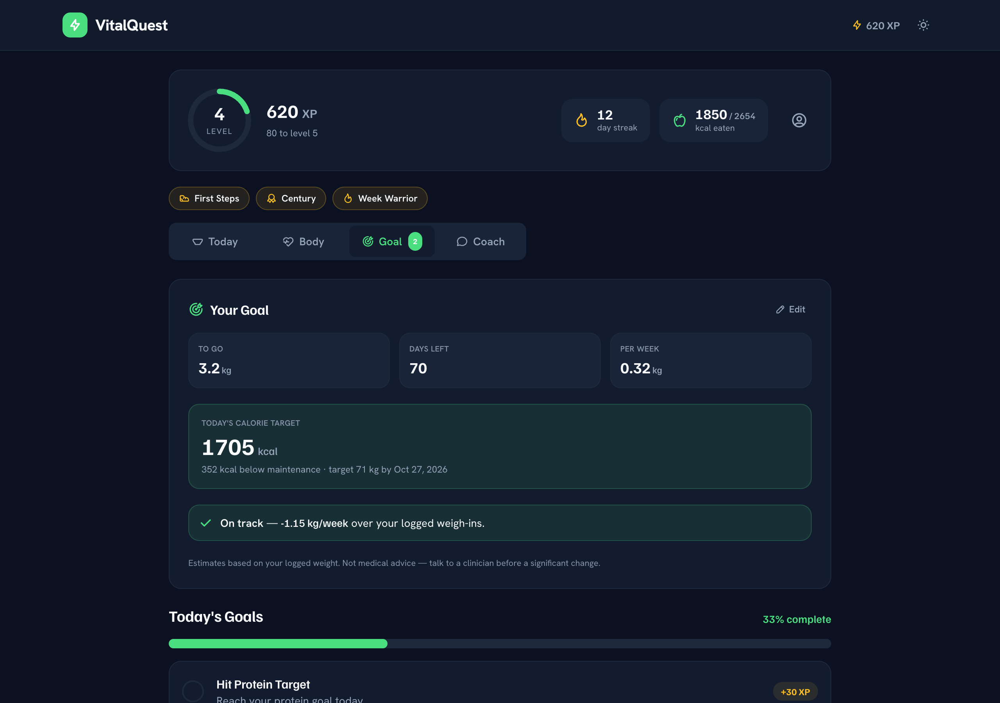

# VitalQuest

[](https://github.com/jpicartz/VitalQuest/actions/workflows/ci.yml)
[](LICENSE)

**An evidence-based wellness tracker.** Log what you eat in plain English, then see which body systems today's food actually supported — and which single nutrient is holding several of them back.

🔗 **[Live app →](https://vital-quest-rho.vercel.app)**

> ⚠️ VitalQuest provides general wellness information generated by AI. It is not medical advice, diagnosis, or treatment. Talk to a qualified healthcare professional before changing your diet, starting a supplement, or altering any medication.



<table>
<tr>
<td width="50%"></td>
<td width="50%"></td>
</tr>
<tr>
<td align="center"><em>Today — light</em></td>
<td align="center"><em>Goal — dark</em></td>
</tr>
</table>

---

## What it does

Four destinations, each answering one question.

| | |
|---|---|
| **Today** · *what did I eat?* | Type "2 eggs and a slice of toast" — or say it — and Claude parses it into calories, macros and 28 micronutrients against USDA values. Water, sunlight, favourites and a meal builder live here too. |
| **Body** · *what did it do?* | Seven body systems scored on how well today's intake supports them: hair & nails, skin, muscle, hormonal, energy, immune, bone. Because they share nutrients, the tab leads with the one gap holding the most of them back. |
| **Goal** · *where am I heading?* | A target weight and date turn into today's calorie and protein numbers, plus an on/off-track verdict. Daily quests, weight and exercise logging, and trend charts sit alongside. |
| **Coach** · *why?* | A scoped AI coach anchored to a real finding from your day, not a blank chat box. |

> The reasoning behind the non-obvious choices — and what would have to change to reverse each one — is in [docs/decisions.md](docs/decisions.md).

### Body systems, not raw percentages

"Vitamin B12: 34%" means nothing to most people. "Energy support: 33%" is a sentence.

The seven scores are computed in `utils/bodySystems.ts` — pure, deterministic, **no AI call** — from the same consumed-nutrient map the micronutrient score uses. The framing is deliberate and load-bearing: every label says *support*, never *grade*. The app measures what you ate, not your actual skin or hormones, and a test asserts the word "grade" appears nowhere in the component.

Because the systems overlap (vitamin D feeds hair, muscle, hormones and bone; zinc feeds hair, skin and hormones), one shortfall usually drags several scores down at once. `computeLimitingNutrients()` finds those shared constraints, which is what turns a dashboard into an instruction.

### Goals refuse unsafe targets

The eating-disorder guardrails live in `utils/goalProjection.ts` as pure functions — **not in a prompt**. Targets below a healthy BMI, trajectories faster than ~1% of bodyweight per week, and deficits that push intake under 1200 kcal are refused outright, with a safe alternative offered where one exists. The coach inherits a system that already refuses, and adds a second client-side intent screen that runs *before* any network call. A calorie tracker with an AI coach has real exposure here, and a prompt is the weakest possible place for the highest-severity rule.

### Also

Natural-language and **voice** food logging · XP, levels, daily quests and 8 badges · water, sunlight, weight and exercise tracking · PDF export · light and dark themes, both tuned to WCAG AA.

## Tech stack

**React 19** · **TypeScript** · **Vite 6** · **Tailwind CSS 3.4** · **Recharts** · **Claude API** · deployed on **Vercel**

State is persisted to `localStorage` — no account, no database, no tracking. Your data stays in your browser.

## Architecture

```
Browser (React SPA)
   │  POST /api/claude          ← no API key ever reaches the client bundle
   ▼
Vercel serverless function      ← api/claude.ts
   │  validates + sanitises, then forwards with a server-side key
   ▼
Anthropic Messages API
```

### The proxy is the interesting part

`api/claude.ts` never forwards the request body verbatim. Every call is rebuilt from a whitelist, because an unprotected AI proxy is a way to spend someone else's money:

- **Model allowlist** — only the two models the app actually uses; a request for a more expensive model is rejected outright.
- **Output clamp** — `max_tokens` is bounded on both ends.
- **Text-only content** — image blocks with URL sources are rejected, so the endpoint can't be used to make Anthropic fetch arbitrary URLs.
- **Size guards** — body and system-prompt caps that hold up under chunked encoding.
- **Rate limiting** — per-IP, keyed on Vercel's edge-set headers rather than the spoofable `x-forwarded-for`.
- **Opaque errors** — upstream failures are logged server-side and returned generically, so the endpoint never leaks key validity or billing state.

Two model tiers keep costs sensible: Sonnet for plan generation and weekly insights, Haiku for food parsing, meal suggestions, and recipes (~20× cheaper).

Locked down further by a strict CSP with no `unsafe-inline`/`unsafe-eval` in `script-src`, plus `X-Frame-Options`, `nosniff`, and a restrictive `Permissions-Policy` (see `vercel.json`).

## Run locally

**Prerequisites:** Node.js 20 (what CI runs; 18+ will build) and an [Anthropic API key](https://console.anthropic.com/).

```bash
git clone https://github.com/jpicartz/VitalQuest.git
cd VitalQuest
npm install
```

Create `.env.local`:

```bash
VITE_ANTHROPIC_API_KEY=sk-ant-your-key-here
```

> In development the browser calls Anthropic directly using this key so you don't need a serverless runtime. In production that branch is stripped from the bundle and all traffic goes through `/api/claude` using the server-side `ANTHROPIC_API_KEY` environment variable.

```bash
npm run dev        # http://localhost:3000
npm run build      # production build
npm run typecheck  # tsc --noEmit
npm test           # vitest, watch mode
npm run test:run   # vitest, single run (what CI runs)
```

## Tests

484 tests, run on every push by [CI](.github/workflows/ci.yml) alongside typecheck and build. Two Vitest projects: pure logic in a fast `node` environment, component tests in `jsdom` with Testing Library.

| Area | What's covered |
|---|---|
| `api/claude.ts` | Every rejection path in the proxy: the image-URL block that would let the endpoint fetch arbitrary URLs, `x-forwarded-for` spoofing vs Vercel's edge headers, origin matching against lookalike hosts, the `max_tokens` clamp, and an assertion that injected `tools`/`metadata`/`stream` never reach Anthropic. |
| `utils/bodySystems.ts` | The seven system scores, ceiling nutrients scored inversely, and an invariant that every nutrient a system references has a target, a unit, and an alias in the key map. |
| `utils/goalProjection.ts` | The refusals: sub-BMI-floor targets, trajectories over ~1%/week, and deficits that would push intake below 1200 kcal. |
| `utils/coachSafety.ts` | The client-side intent screen that runs before any coach request reaches the network. |
| `utils/nutritionAggregates.ts` | Micronutrient scoring against real USDA targets, and coercion of the string values (`"28g"`) the model occasionally returns. |
| `utils/metricsUtils.ts` | Mifflin-St Jeor BMR, activity multipliers, goal adjustments, and macro targets. |
| `utils/streakUtils.ts` | Streak transitions across month, year, leap-day and DST boundaries. |
| `utils/badgeUtils.ts` | All 8 unlock thresholds, plus an invariant that every awardable badge id actually exists in the badge catalogue. |
| `services/claudeService.ts` | Markdown-fence stripping and recovery from the malformed JSON LLMs emit — including a raw newline inside a string value. |
| `components/` | That every surface in [the inventory](docs/v2-surface-inventory.md) is still reachable, plus the keyboard contract for tablists and radiogroups and that no form control ships unlabelled. |

Two of those component tests exist because of bugs that shipped silently and were caught by hand, not by a test:

- **A whole surface went missing during the navigation restructure.** The micronutrient snapshot lived in a sub-tab that was retired; nothing referenced it afterwards. No error, no failing test, no visual glitch — only a row-by-row walk of the surface inventory against the running app found it.
- **Six `<label>` elements had no `htmlFor`.** Decorative markup: screen readers announced those inputs as unlabelled. `components/ui/labels.test.tsx` now fails the build if a bare label reappears.

Dates are pinned to `TZ=UTC` in `vite.config.ts`; `utils/dateUtils.ts` is deliberately local-time (it avoids the UTC shift `toISOString()` introduces), so an unpinned timezone would make the suite flaky.

## Deploying

Import the repo on Vercel and set `ANTHROPIC_API_KEY` as an environment variable. `vercel.json` handles the build, SPA rewrites, security headers, and function timeout. Set a spend limit in the Anthropic console — it's the real backstop behind the proxy's rate limiting.

## Project layout

```
api/claude.ts          Hardened serverless proxy
components/            UI — Dashboard shell, the four destinations, Onboarding
components/ui/         Primitives: Card, Field, Button, Modal, SegmentedControl, …
components/panels/     Goal, weight, exercise, quests, achievements, coach
contexts/              ProfileContext, LogsContext (data and actions split)
services/              Claude API calls and prompts
utils/                 Body systems, goal projection, coach safety, streaks, badges
data/                  Nutrient reference data and badge definitions
docs/                  Decision record, surface inventory, screenshots
*.test.ts(x)           Colocated next to the module they cover
```

## License

MIT — see [LICENSE](LICENSE).
