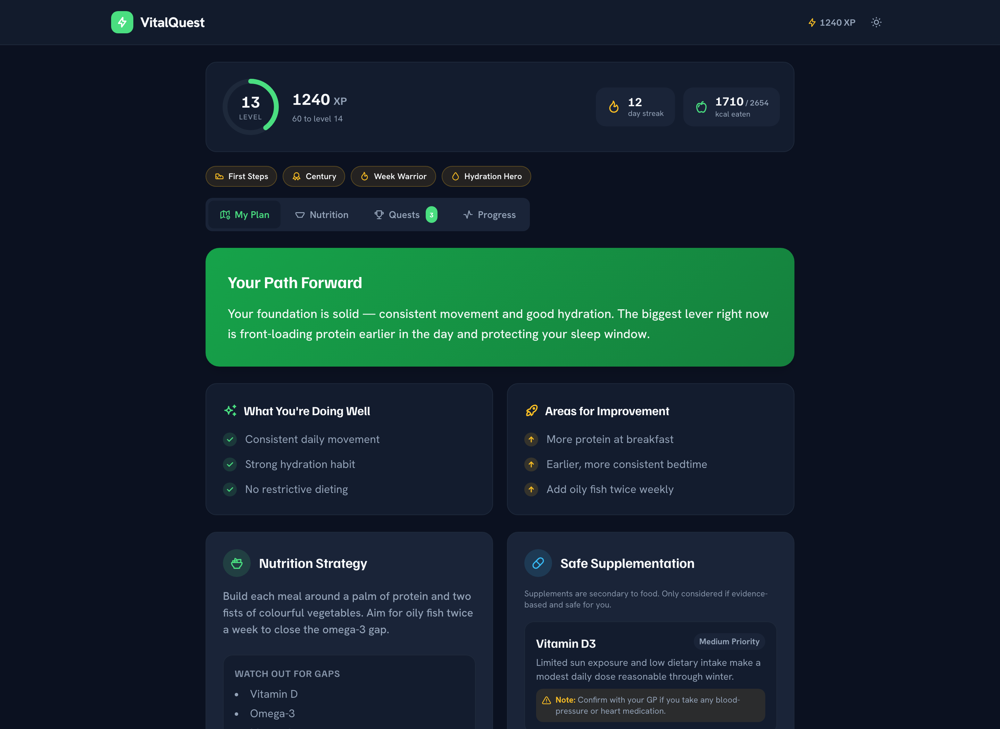
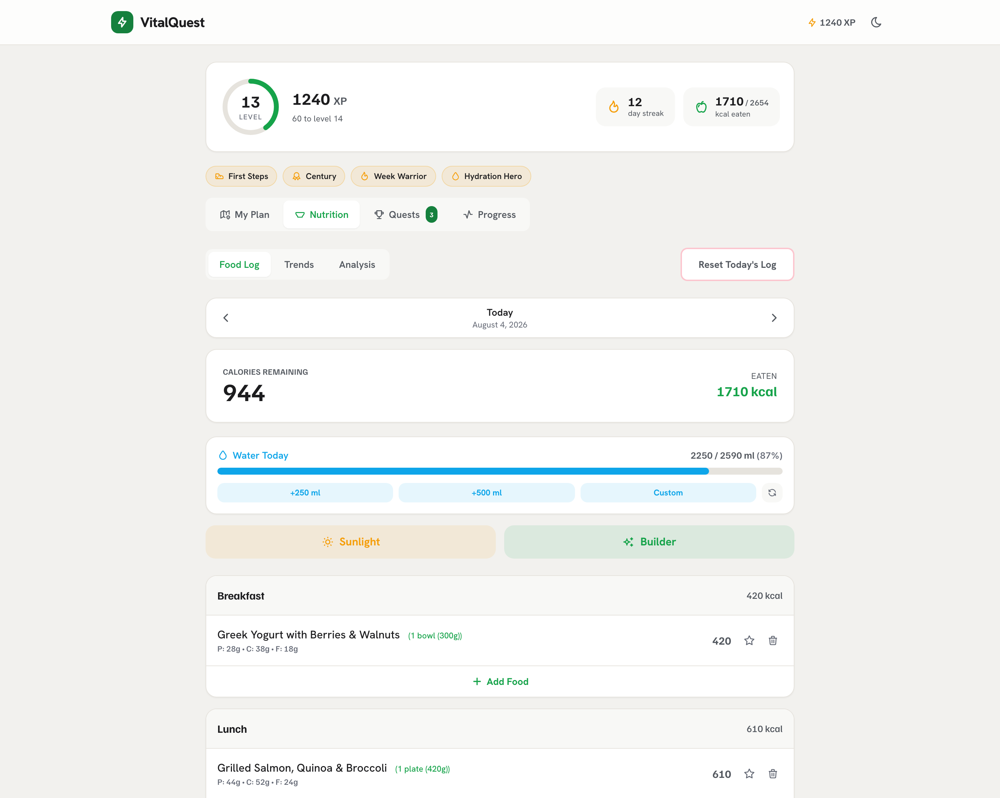
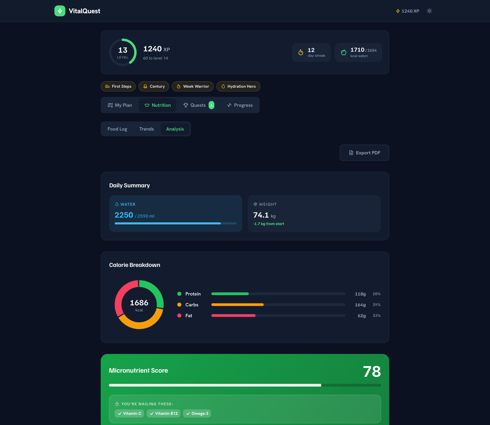

# VitalQuest

[](https://github.com/jpicartz/VitalQuest/actions/workflows/ci.yml)
[](LICENSE)

**An evidence-based, gamified wellness tracker.** Log what you eat in plain English, see where your micronutrients actually land, and keep a streak going with daily quests.

🔗 **[Live app →](https://vital-quest-rho.vercel.app)**

> ⚠️ VitalQuest provides general wellness information generated by AI. It is not medical advice, diagnosis, or treatment. Talk to a qualified healthcare professional before changing your diet, starting a supplement, or altering any medication.



<table>
<tr>
<td width="50%"></td>
<td width="50%"></td>
</tr>
<tr>
<td align="center"><em>Food log — light</em></td>
<td align="center"><em>Micronutrient analysis — dark</em></td>
</tr>
</table>

---

## What it does

| | |
|---|---|
| 🍎 **Natural-language food logging** | Type "2 eggs and a slice of toast" — Claude parses it into calories, macros, and 28 micronutrients using USDA values. |
| 🧬 **Micronutrient scoring** | Most trackers stop at macros. VitalQuest scores daily micronutrient coverage and shows exactly which nutrients you're short on. |
| 🎯 **Personalised plan** | A wellness plan generated from your profile — including any medications or conditions you report, which are screened for interactions. |
| 🏆 **Gamification** | XP, levels, daily quests that reset at midnight, streak tracking, and 8 unlockable badges. |
| 💧 **Water, sunlight, weight, exercise** | Daily hydration goal derived from body weight, plus weight trends and exercise logging. |
| 📊 **Trends & analysis** | Calorie/protein charts, macro breakdown, and an AI weekly pattern summary. |
| 🌓 **Light and dark themes** | A full dual-mode design system. |

## Tech stack

**React 19** · **TypeScript** · **Vite 6** · **Tailwind CSS 3.4** · **Recharts** · **Claude API** · deployed on **Vercel**

State is persisted to `localStorage` — no account, no database, no tracking. Your data stays in your browser.

## Architecture

```
Browser (React SPA)
   │  POST /api/claude          ← no API key ever reaches the client bundle
   ▼
Vercel serverless function      ← api/claude.ts
   │  validates + sanitises, then forwards with a server-side key
   ▼
Anthropic Messages API
```

### The proxy is the interesting part

`api/claude.ts` never forwards the request body verbatim. Every call is rebuilt from a whitelist, because an unprotected AI proxy is a way to spend someone else's money:

- **Model allowlist** — only the two models the app actually uses; a request for a more expensive model is rejected outright.
- **Output clamp** — `max_tokens` is bounded on both ends.
- **Text-only content** — image blocks with URL sources are rejected, so the endpoint can't be used to make Anthropic fetch arbitrary URLs.
- **Size guards** — body and system-prompt caps that hold up under chunked encoding.
- **Rate limiting** — per-IP, keyed on Vercel's edge-set headers rather than the spoofable `x-forwarded-for`.
- **Opaque errors** — upstream failures are logged server-side and returned generically, so the endpoint never leaks key validity or billing state.

Two model tiers keep costs sensible: Sonnet for plan generation and weekly insights, Haiku for food parsing, meal suggestions, and recipes (~20× cheaper).

Locked down further by a strict CSP with no `unsafe-inline`/`unsafe-eval` in `script-src`, plus `X-Frame-Options`, `nosniff`, and a restrictive `Permissions-Policy` (see `vercel.json`).

## Run locally

**Prerequisites:** Node.js 18+ and an [Anthropic API key](https://console.anthropic.com/).

```bash
git clone https://github.com/jpicartz/VitalQuest.git
cd VitalQuest
npm install
```

Create `.env.local`:

```bash
VITE_ANTHROPIC_API_KEY=sk-ant-your-key-here
```

> In development the browser calls Anthropic directly using this key so you don't need a serverless runtime. In production that branch is stripped from the bundle and all traffic goes through `/api/claude` using the server-side `ANTHROPIC_API_KEY` environment variable.

```bash
npm run dev        # http://localhost:3000
npm run build      # production build
npm run typecheck  # tsc --noEmit
npm test           # vitest, watch mode
npm run test:run   # vitest, single run (what CI runs)
```

## Tests

200 unit tests covering the pure logic, run on every push by [CI](.github/workflows/ci.yml) alongside typecheck and build. No component tests — this suite deliberately targets the parts where a silent regression would actually hurt:

| Area | What's covered |
|---|---|
| `api/claude.ts` | Every rejection path in the proxy: the image-URL block that would let the endpoint fetch arbitrary URLs, `x-forwarded-for` spoofing vs Vercel's edge headers, origin matching against lookalike hosts, the `max_tokens` clamp, and an assertion that injected `tools`/`metadata`/`stream` never reach Anthropic. |
| `utils/nutritionAggregates.ts` | Micronutrient scoring against real USDA targets, and coercion of the string values (`"28g"`) the model occasionally returns. |
| `utils/metricsUtils.ts` | Mifflin-St Jeor BMR, activity multipliers, goal adjustments, and macro targets. |
| `utils/streakUtils.ts` | Streak transitions across month, year, leap-day and DST boundaries. |
| `utils/badgeUtils.ts` | All 8 unlock thresholds, plus an invariant that every awardable badge id actually exists in the badge catalogue. |
| `services/claudeService.ts` | Markdown-fence stripping and recovery from the malformed JSON LLMs emit — including a raw newline inside a string value. |

Dates are pinned to `TZ=UTC` in `vite.config.ts`; `utils/dateUtils.ts` is deliberately local-time (it avoids the UTC shift `toISOString()` introduces), so an unpinned timezone would make the suite flaky.

## Deploying

Import the repo on Vercel and set `ANTHROPIC_API_KEY` as an environment variable. `vercel.json` handles the build, SPA rewrites, security headers, and function timeout. Set a spend limit in the Anthropic console — it's the real backstop behind the proxy's rate limiting.

## Project layout

```
api/claude.ts          Hardened serverless proxy
components/            UI (Dashboard, NutritionTracker, Onboarding, …)
services/              Claude API calls and prompts
utils/                 Streaks, badges, metrics, nutrition aggregates
data/                  Nutrient reference data and badge definitions
*.test.ts              Colocated next to the module they cover
```

## License

MIT — see [LICENSE](LICENSE).
